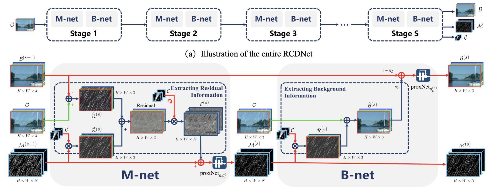

# RCDNet

A PyTorch implementation of RCDNet based on CVPR 2020 paper
[A Model-driven Deep Neural Network for Single Image Rain Removal](https://arxiv.org/abs/2005.01333).



## Requirements

- [Anaconda](https://www.anaconda.com/download/)

- [PyTorch](https://pytorch.org)

```
conda install pytorch=1.10.1 torchvision cudatoolkit -c pytorch
```

## Dataset

[Rain100L](https://mega.nz/file/MpgnwYDS#jqyDEyL1U9srLBbEFCPnAOZb2HZTsSrwSvRGQ6m6Dzc),
[Rain100H](https://www.dropbox.com/s/kzbzer5wem37byg/rain100H.zip?dl=0),
[Rain1400](https://mega.nz/file/XSxSEajb#6ZwCOSeFqAnErIg6bIjs_bUFOKcs7HoZ2rwXCP8htZc)
and [SPA-Data](https://www.kaggle.com/leftthomas/spadata) are used, download these datasets and make sure the directory
like this:
```                           
|-- data     
    |-- rain100L
        |-- train
            |-- rain
                norain-1.png
                ...
            `-- norain
                norain-1.png
                ...
        `-- test                                                        
    |-- rain100H
        same as rain100L
    `-- rain1400
        same as rain100L                       
    |-- spa
        same as rain100L
```

## Usage

You can easily train and test the model by running the script below. If you want to try other options, please refer to
[utils.py](utils.py).

### Train Model

```
python main.py --data_name rain100L --seed 0
```

### Test Model

```
python main.py --data_name rain100H --model_file result/rain100H.pth
```

## Benchmarks

The models are trained on one NVIDIA GeForce RTX 3090 GPU (24G). All the hyper-parameters are the default values.

<table>
<thead>
  <tr>
    <th rowspan="3">Method</th>
    <th colspan="2">Rain100L</th>
    <th colspan="2">Rain100H</th>
    <th colspan="2">Rain1400</th>
    <th colspan="2">SPA-Data</th>
    <th rowspan="3">Download</th>
  </tr>
  <tr>
    <td align="center">PSNR</td>
    <td align="center">SSIM</td>
    <td align="center">PSNR</td>
    <td align="center">SSIM</td>
    <td align="center">PSNR</td>
    <td align="center">SSIM</td>
    <td align="center">PSNR</td>
    <td align="center">SSIM</td>
  </tr>
</thead>
<tbody>
  <tr>
    <td align="center">Ours</td>
    <td align="center"> </td>
    <td align="center"> </td>
    <td align="center"> </td>
    <td align="center"> </td>
    <td align="center"> </td>
    <td align="center"> </td>
    <td align="center"> </td>
    <td align="center"> </td>
    <td align="center"><a href="https://mega.nz/folder/t4wi1QhZ#zhr0_u0_vr4bD9xDTwFuig">MEGA</a></td>
  </tr>
  <tr>
    <td align="center">Official</td>
    <td align="center">40.00</td>
    <td align="center">0.9860</td>
    <td align="center">31.28</td>
    <td align="center">0.9093</td>
    <td align="center">33.04</td>
    <td align="center">0.9472</td>
    <td align="center">41.47</td>
    <td align="center">0.9834</td>
    <td align="center"><a href="https://github.com/hongwang01/RCDNet_simple">Github</a></td>
  </tr>
</tbody>
</table>
